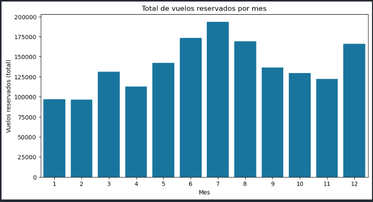
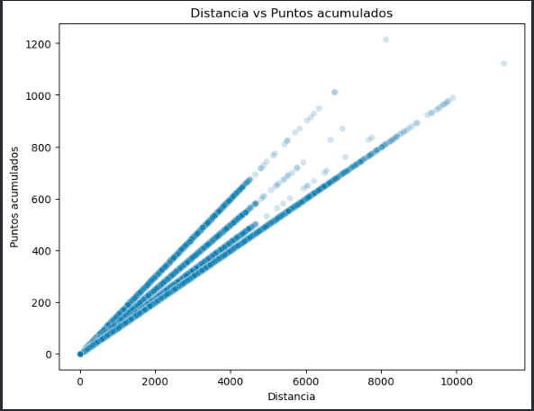
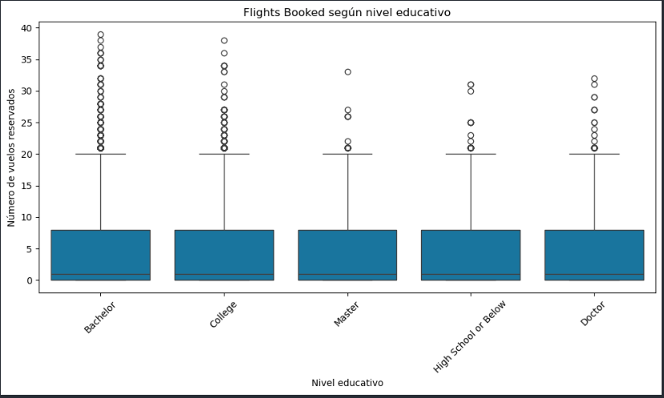

# Actividad de vuelos y programa de fidelización de una aerolínea

     

Prueba técnica individual del módulo 3 del **Bootcamp de Data Analytics & IA de Adalab**: dos CSV, un enunciado con preguntas y 48 horas para entregarlo.



---

## Resumen del proyecto

- **Pregunta:** ¿cómo se comportan los clientes del programa de fidelización de una aerolínea y hay diferencias en sus reservas según su nivel educativo?
- **Datos:** actividad mensual de vuelos (405.624 filas) y datos del programa de fidelización (16.737 clientes), 2017–2018.
- **Qué hice:** todo el proyecto, de forma individual. Validación de claves, eliminación de 1.864 duplicados exactos y consolidación cliente-año-mes (401.688 registros); unión de los dos datasets; EDA; limpieza de salarios (negativos corregidos y nulos imputados con la mediana por nivel educativo); correlaciones de Spearman y gráficos.
- **Resultados:** las reservas suben en verano y tocan techo en julio; la distancia volada y los puntos acumulados van casi a la par (Spearman 0,998); el número de vuelos reservados apenas cambia con el nivel educativo (media de 4,13 a 4,23 al mes).
- **Limitaciones:** ejercicio con tiempo cerrado y análisis descriptivo, sin modelado.

---

## Gráficos

### Distancia volada y puntos acumulados



### Vuelos reservados según nivel educativo



La mediana es de 1 vuelo al mes en todos los niveles educativos y la distribución es casi idéntica: el nivel educativo no marca diferencias en las reservas.

---

## Flujo de trabajo

| Notebook | Qué hace |
|---|---|
| [`01_preparacion_y_merge.ipynb`](notebooks/01_preparacion_y_merge.ipynb) | Validación de claves, duplicados, consolidación cliente-año-mes y unión de los datasets |
| [`02_EDA.ipynb`](notebooks/02_EDA.ipynb) | Estructura, nulos, valores atípicos (IQR) y coherencia de variables |
| [`03_limpieza.ipynb`](notebooks/03_limpieza.ipynb) | Nombres en snake_case, variable `cancelled`, tratamiento de `salary`, variables constantes |
| [`04_analisis.ipynb`](notebooks/04_analisis.ipynb) | Estadística descriptiva, correlación de Spearman, gráficos y respuesta a las preguntas del enunciado |

---

## Estructura del repositorio

```text
.
├── README.md
├── assets/                 # gráficos generados en los notebooks
├── data/
│   ├── raw/                # CSV originales
│   └── processed/          # dataset unido y dataset limpio
└── notebooks/              # 01 → 04
```

---

## Cómo reproducirlo

```bash
git clone https://github.com/nieves-sanchez/bda-modulo-3-evaluacion-final-nieves-sanchez.git
cd bda-modulo-3-evaluacion-final-nieves-sanchez
pip install pandas numpy matplotlib seaborn jupyter
jupyter notebook notebooks/
```

Ejecuta los notebooks en orden (01 → 04). Los CSV procesados ocupan unos 105 MB.

---

## Autora

**Nieves Sánchez**

[](https://github.com/nieves-sanchez)
[](https://www.linkedin.com/in/nieves-sanchez-data)
[](mailto:nsanchezgarcia86@gmail.com)
